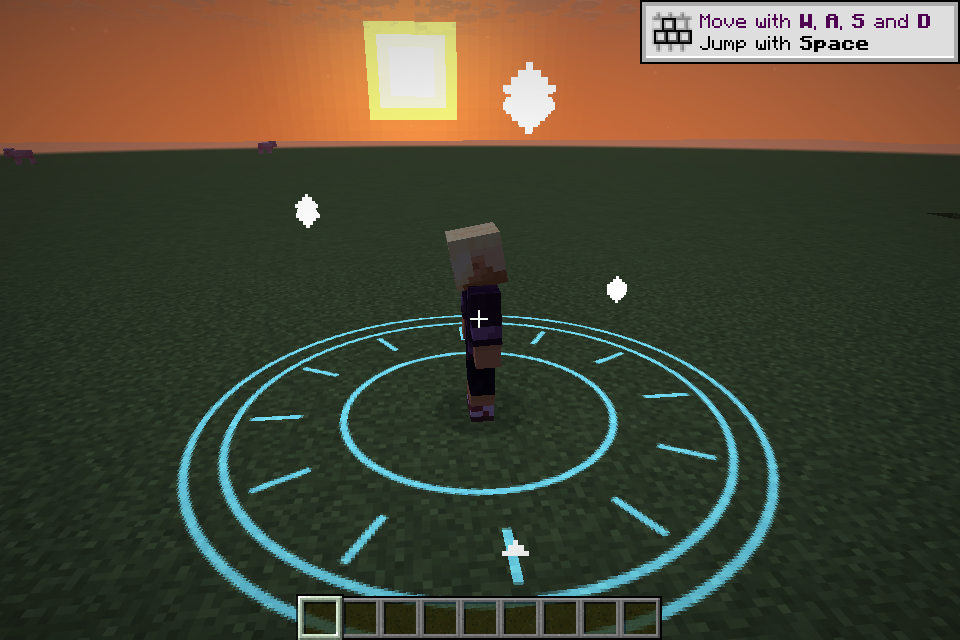
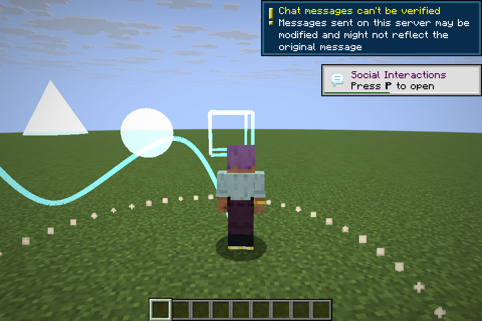
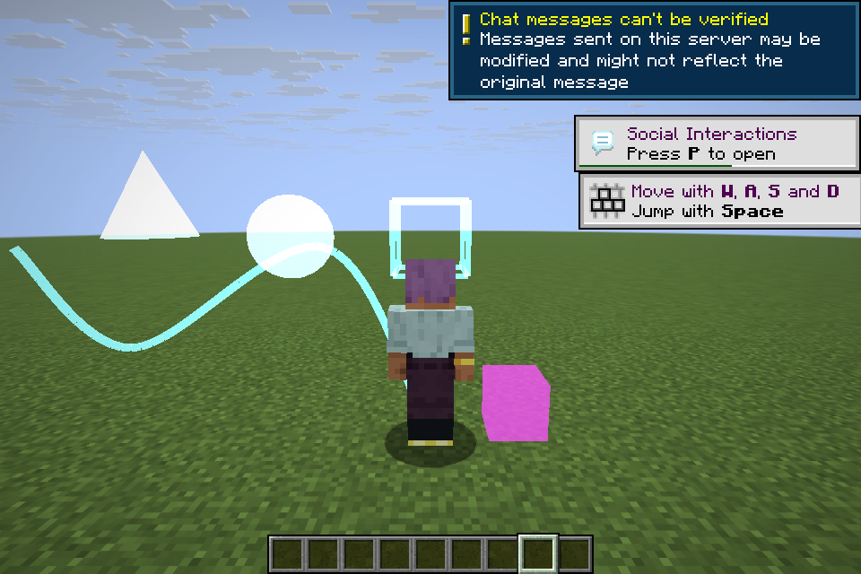

# 镜头与特效验证 / Scene verification

验证使用隔离的开发客户端与专用服务器，不使用现有游戏存档。Java 25、Gradle 9.3.0，Windows 11 / NVIDIA RTX 5060 Ti。

Verification uses isolated development clients and dedicated servers, without existing saves. Environment: Java 25, Gradle 9.3.0, Windows 11 / NVIDIA RTX 5060 Ti.

## 可重复执行的检查 / Reproducible checks

```powershell
.\gradlew.bat :common:26.1.2:test :common:26.2:test `
  :common:26.1.2:verifySceneExamples :common:26.2:verifySceneExamples
.\gradlew.bat :fabric:26.1.2:build :fabric:26.2:build `
  :neoforge:26.1.2:build :neoforge:26.2:build `
  :paper:26.1.2:build :paper:26.2:build
```

JUnit 覆盖插值边界、±180° 旋转、时间线顺序／并行／指定时间／重复、暂停恢复、镜头替换、目标失效、owner 清理、回调异常、预算、重入工厂、100 次取消和网络校验。示例检查实际编译发布示例和游戏探针，避免文档样例只有形式正确。

JUnit covers interpolation endpoints, ±180° rotation, scheduling and repetition, pause/resume, camera replacement, missing targets, owner cleanup, callback failures, budgets, reentrant factories, 100 cancellation cycles, and packet validation. Example verification compiles the shipped example and game probes.

## 游戏探针 / In-game probe

`common/src/test/resources/scene-probe/Probe.kt` 和其中的 `manifest.json` 是仅供隔离验证客户端安装的全局脚本包。不要把 `ServerProbe.kt` 当作客户端探针的一部分复制。

Install `Probe.kt` and its `manifest.json` from `common/src/test/resources/scene-probe/` as a global pack in the isolated client. Copy `ServerProbe.kt` separately for server verification.

验证客户端预装 `examples/client-scenes`，将该临时副本的客户端阶段改为 `ClientPhase.READY`，并将清单中的 `clientSync` 设为 `false`。服务器在世界目录预装完全相同的临时示例副本；这保证代码版本相同，并避免测试自动化卡在首次信任提示。正式示例按 [API 文档](client-scenes.md) 安装，无需修改。

Preinstall a temporary copy of the example on the client, changing its client phase to `ClientPhase.READY` and `clientSync` to `false`. Install the identical temporary copy in the server's world directory. This preserves revision equality and avoids an unattended first-trust prompt. Normal users follow the [API documentation](client-scenes.md) without these test-only changes.

通过 `run.init.gradle` 指定隔离目录；Fabric 的目录须与项目位于同一磁盘。先启动服务器，再启动客户端：

Use `run.init.gradle` to select isolated directories; Fabric's directory must be on the project's drive. Start the server before its client:

```powershell
.\gradlew.bat :fabric:26.2:runServer `
  -I common/src/test/resources/scene-probe/run.init.gradle `
  '-PscenePlatform=fabric' '-PsceneVersion=26.2' '-PsceneRole=server' `
  '-PsceneDirectory=F:/AST/katton-scene-live/fabric-26.2-server'
.\gradlew.bat :fabric:26.2:runClient `
  -I common/src/test/resources/scene-probe/run.init.gradle `
  '-PscenePlatform=fabric' '-PsceneVersion=26.2' '-PsceneRole=client' `
  '-PsceneDirectory=F:/AST/katton-scene-live/fabric-26.2-client'
```

临时服务器使用端口 25585；`scenePort` 可以覆盖客户端连接端口。替换平台和版本参数即可复验其他组合。探针保存五张截图，检查 FOV 设置、第一／第三人称、Esc 注入、几何缓冲、100 次逐次绘制／取消和资源重载；成功打印 `SCENE_PROBE PASS` 并自动退出。创建 `scene-probe-keep-open` 文件可在通过后进入观众模式，继续生命周期检查。

The isolated server uses port 25585; `scenePort` overrides the client's connection port. Change platform/version arguments for other combinations. The probe saves five screenshots, checks FOV settings, first/third person, Esc injection, geometry buffers, 100 render/cancel cycles and resource reload, then prints `SCENE_PROBE PASS` and exits. Create `scene-probe-keep-open` to enter observer mode after passing for further lifecycle checks.

## 双客户端探针 / Two-client probe

客户端游戏目录中的空文件 `scene-probe-peer` 启用观众模式，使用 `sceneUsername` 分配不同离线用户名。状态变化打印 `SCENE_PEER`；创建 `scene-probe-skip` 文件跳过该观众的镜头，创建 `scene-probe-exit` 文件退出。

An empty `scene-probe-peer` file enables observer mode. Assign distinct offline names with `sceneUsername`. State changes print `SCENE_PEER`; create `scene-probe-skip` to skip that viewer, or `scene-probe-exit` to exit.

在服务器世界目录安装独立 `ServerProbe.kt` 包，清单必须包含 `dependencies: []` 和 `clientSync: false`。控制台 `/sceneprobe one` 选择 UUID 排序后的第一名玩家，`/sceneprobe nearby` 向其周围 32 格播放，`/sceneprobe stop` 取消上次远程句柄。测试演出版本显式固定为 `probe-1`。

Install `ServerProbe.kt` as a separate world pack with `dependencies: []` and `clientSync: false`. Console commands `sceneprobe one`, `sceneprobe nearby`, and `sceneprobe stop` exercise a selected player, a 32-block radius around that player, and remote cancellation. The test definition uses the explicit revision `probe-1`.

死亡验证使用 `sceneprobe death` 将选中玩家生命值设为 0；客户端创建 `scene-probe-respawn` 文件请求复活。演出期间传送到其他维度或踢出玩家，观察 `scenes=0, effects=0, buffers=0, locked=false`。

For death validation, `sceneprobe death` sets the selected player's health to zero. Create `scene-probe-respawn` in the client directory to request respawn. Change dimension or disconnect during playback and check `scenes=0, effects=0, buffers=0, locked=false`.

## 单机与重载探针 / Singleplayer and reload probe

在隔离客户端创建名为 `SceneValidation` 的单机存档。全局安装普通探针、临时 READY 阶段示例、独立 `IntegrationProbe.kt` 包，并创建 `scene-probe-keep-open` 文件。世界目录安装正式示例以及 `reload-pack/` 中的文件。独立包清单设置唯一 ID、`dependencies: []` 和 `clientSync: false`。启动参数增加 `'-PsceneWorld=SceneValidation'`，替代多人快速连接。

Create an isolated singleplayer save named `SceneValidation`. Globally install the normal probe, the temporary READY-phase example, and a separate pack containing `IntegrationProbe.kt`; create `scene-probe-keep-open`. Install the normal shipped example and `reload-pack/` files under the world's `kattonpacks`. Each separate pack needs a unique manifest ID, `dependencies: []`, and `clientSync: false`. Add `'-PsceneWorld=SceneValidation'` to select singleplayer quick play.

普通探针完成后，集成探针测试真实暂停菜单、恢复、预编译失败、入口激活失败和旧定义重播，再检查死亡、复活、换维度和断线。它会临时改写隔离世界的 `ReloadScene.kt` 并恢复原文；日志中预期出现两次脚本错误。最终成功标记为 `SCENE_INTEGRATION PASS`。

After the normal probe passes, the integration probe exercises the actual pause menu, resume, precompile failure, entrypoint activation failure and replay of the restored definition, followed by death, respawn, dimension change and disconnect. It temporarily edits the isolated world's `ReloadScene.kt` and restores its original contents. Two script errors are intentional. Success is reported as `SCENE_INTEGRATION PASS`.

## 验证记录 / Results

验证日期：2026-09-08（UTC+8）。以下为实际执行结果。

Executed on 2026-09-08 (UTC+8).

| 检查 / Check | 结果 / Result |
|---|---|
| Common 26.1.2 JUnit | 101 tests, 0 failures, 0 skipped |
| Common 26.2 JUnit | 101 tests, 0 failures, 0 skipped |
| 两版本脚本编译 / Script compilation, both versions | PASS：发布示例与全部验证探针 / Shipped example and all probes |
| Fabric 26.1.2 / 26.2 build | PASS |
| NeoForge 26.1.2 / 26.2 build | PASS |
| Paper 26.1.2 / 26.2 build | PASS |
| Fabric 26.1.2 专用服务器与客户端 / Dedicated server and client | PASS：演出、100 次取消、资源重载、死亡／复活、换维度、断线 |
| Fabric 26.2 专用服务器与客户端 / Dedicated server and client | PASS：演出、100 次取消、资源重载；单机补充生命周期与重载检查 |
| NeoForge 26.1.2 专用服务器与客户端 / Dedicated server and client | PASS：演出、100 次取消、资源重载、死亡／复活、换维度、断线 |
| NeoForge 26.2 专用服务器与客户端 / Dedicated server and client | PASS：演出、100 次取消、资源重载、死亡／复活、换维度、断线 |

四个组合均在真实渲染客户端执行第一／第三人称、独立 FOV、Esc 跳过、几何绘制和法阵贴图检查；专用服务器均成功启动并接收玩家连接，未初始化客户端演出管理器。FOV 持久化选项保持原值。每个组合的 100 次测试均跨渲染帧播放／取消，最终 `scenes=0, effects=0, buffers=0`；没有观察到画面残留或输入锁死。

All four combinations used real rendering clients for first/third person, standalone FOV, Esc skip, geometry and magic-circle texture checks. Dedicated servers started and accepted players without initializing the client scene manager. Saved FOV options remained unchanged. Each 100-cycle run rendered between play and cancel, ending at `scenes=0, effects=0, buffers=0`, without observed persistent visuals or locked input.

NeoForge 26.2 双客户端实测：指定玩家仅启动一名观众；同维度 32 格范围内两名观众均启动；A 跳过后 B 继续；远程停止结束 B；A 移至范围外时不启动，重新进入范围不补播；A 换维度时仅清理 A。

Two NeoForge 26.2 clients verified selected-player delivery, delivery to both viewers within 32 blocks, local skip by A while B continued, remote cancellation of B, exclusion outside the radius, no replay on re-entry, and cleanup of A alone after a dimension change.

Fabric 26.2 单机集成探针的实际输出：

Actual Fabric 26.2 singleplayer integration output:

```text
SCENE_PROBE cycles100 {definitions=6, scenes=0, effects=0, buffers=0}
SCENE_INTEGRATION pause PASS
SCENE_INTEGRATION precompile preservation PASS
SCENE_INTEGRATION activation rollback PASS
SCENE_INTEGRATION death PASS
SCENE_INTEGRATION dimension PASS
SCENE_INTEGRATION disconnect PASS
SCENE_INTEGRATION PASS
SCENE_PEER null {definitions=1, scenes=0, effects=0, buffers=0} locked=false alive=null dimension=null
```

预编译失败后原句柄仍活动且镜头继续接管；激活失败后原句柄结束原因为 `RELOAD`，镜头和输入释放，旧定义可再次播放。最终剩余的一个定义是全局探针定义；世界定义已清理。单机暂停与失败回滚实机检查运行于 Fabric 26.2，共享运行时的对应行为另在两版本 JUnit 中验证。

After precompile failure, the original handle remained active and retained camera control. After activation failure, that handle ended with `RELOAD`, camera/input control was released, and the old definition could be played again. The one remaining definition is the global probe; world definitions were removed. Real pause and failure-recovery checks ran on Fabric 26.2; corresponding shared-runtime behavior also has JUnit coverage on both versions.

### 画面记录 / Captured frames

Fabric 26.2 路径镜头与法阵，镜头接管时隐藏第一人称手部：

Fabric 26.2 camera path and textured circle, with the first-person hand suppressed during camera control:



NeoForge 26.2 曲线与基本几何体：

NeoForge 26.2 curve and basic geometry:



Fabric 26.1.2 Alpha／深度验证：地下两个盒体中仅显式透视的紫色盒体可见。

Fabric 26.1.2 Alpha/depth check: of two underground boxes, only the magenta box with explicit through-wall rendering is visible.



### 范围与后续检查 / Scope and further checks

网络实测使用离线回环服务器和预装的相同脚本版本；没有重新验证既有的首次信任提示、签名或脚本包传输流程。Paper 完成构建回归，未启动 Paper 游戏服务器。未测试第三方渲染模组或自定义着色器兼容性。日志中的离线账户验证、OSHI 系统信息和旧 Kotlin 编译器弃用警告不属于演出运行失败。

Network runs used offline loopback servers and identical preinstalled scripts. Existing first-trust prompts, signing and pack transfer were not revalidated. Paper received build regression checks, not a live server run. Third-party renderer and custom shader compatibility was not tested. Offline-account, OSHI and Kotlin compiler deprecation warnings were not scene-runtime failures.

### 交付自检 / Delivery self-evaluation

| 维度 / Criterion | 分数 / Score | 依据 / Evidence |
|---|---|---|
| 准确性 / Accuracy | 5/5 | 两版本测试与四组合真实渲染验证 / Tests on both versions and rendering on all four combinations |
| 完整性 / Completeness | 4/5 | 已交付全部功能；第三方渲染兼容性未测 / All requested features delivered; external renderer compatibility untested |
| 清晰度 / Clarity | 5/5 | 双语 API、行为边界和验证记录 / Bilingual APIs, behavior boundaries and verification record |
| 可操作性 / Actionability | 5/5 | 示例命令、构建任务、独立探针 / Example commands, build tasks and isolated probes |
| 简洁性 / Conciseness | 4/5 | 验证说明较长，但包含复现步骤 / Detailed verification notes include reproducible steps |

平均 4.6/5。后续可将客户端探针接入具有图形环境的 CI，并增加第三方渲染兼容性矩阵。

Average: 4.6/5. Future work can run the client probes in graphical CI and add a third-party renderer compatibility matrix.
