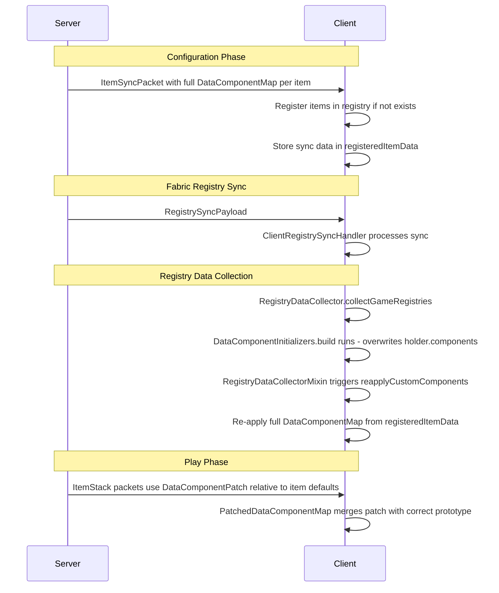

# 客户端物品同步架构重设计

## 问题总结

### 问题 1：第二次进入服务器时 bug 复现
- 第一次连接时，物品被注册到 `BuiltInRegistries.ITEM`，`registeredItemData` 存储了同步数据
- 断开连接时，`reset()` 清理了 `registeredItemData`，但物品仍然留在注册表中
- 第二次连接时，`registerOrUpdateItemOnClient()` 发现物品已存在，跳过注册
- 但 `registeredItemData` 已被清理，`reapplyCustomComponents()` 无数据可用
- `DataComponentInitializers.build()` 再次运行，覆盖 holder.components 为默认值

### 问题 2：组件同步不完整
- 当前 `ItemSyncPacket` 只同步了 `maxStackSize`、`maxDamage`、`translationKey`、`itemName`、`itemModel`
- 服务端物品可能有更多组件（通过 `component()` 方法设置的自定义组件）
- 穷举序列化原版组件不可行，且存在 mod 自定义组件

### 问题 3：客户端白板 Item 与服务端复杂 Item 的行为不一致
- 服务端的 Item 可能是自定义子类，override 了 `use`、`hurtEnemy` 等方法
- 客户端只能创建 `Item(props)` 白板实例，无法复现自定义行为

## 关于问题 3 的分析

### 是否有完美解决方案？

**结论：没有完美的解决方案。** 原因如下：

1. **Kotlin 脚本无法在客户端执行**：脚本只在服务端加载和执行，客户端没有脚本引擎
2. **Java 类无法通过网络传输**：即使能传输字节码，客户端也缺少脚本的运行时依赖
3. **Minecraft 的 C/S 架构本身就是这样设计的**：
   - 大多数物品交互（`use`、`useOn`、`hurtEnemy` 等）由服务端处理
   - 客户端发送交互意图，服务端执行逻辑并同步结果
   - 客户端主要负责渲染和预测

### 可接受的模式：客户端只负责显示

这实际上是 Minecraft 原版的工作方式。即使是原版物品，大部分逻辑也在服务端执行。客户端需要的只是：
- 正确的物品名称显示
- 正确的物品模型/材质
- 正确的组件数据（用于 tooltip、耐久条等客户端渲染）

**唯一的例外**是需要客户端预测的行为（如方块放置预测），但对于脚本物品来说，这些通常不是必需的。

## 解决方案

### 核心思路：使用 `DataComponentMap` 的序列化/反序列化

Minecraft 已经有完整的 `DataComponentMap` 序列化机制（用于 `ItemStack` 的网络同步）。我们可以直接利用这个机制来同步物品的所有组件，而不是手动序列化每个字段。

### 方案详细设计

#### 1. 重新设计 ItemSyncPacket

使用 `DataComponentMap` 的 `STREAM_CODEC` 来序列化/反序列化所有组件：

```
ItemSyncPacket:
  - items: List<ItemData>
    - id: Identifier
    - components: DataComponentMap  // 使用 MC 原生的序列化
```

服务端在 `collectKattonItems()` 中直接获取 `item.components()` 返回的完整 `DataComponentMap`，通过 MC 原生的 codec 序列化。客户端反序列化后直接设置到 holder 上。

这样就不需要手动处理每个组件类型，也自动支持 mod 自定义组件。

#### 2. 修复第二次进入的状态管理

问题的根源是：物品在注册表中持久存在，但同步数据在断开时被清理。

**方案 A：不清理 registeredItemData，改为在每次连接时更新**
- `reset()` 不清理 `registeredItemData`
- 每次收到 `ItemSyncPacket` 时，无论物品是否已存在，都更新 `registeredItemData`
- `registerOrUpdateItemOnClient()` 中，如果物品已存在，也要更新 `registeredItemData`（但不重新注册）
- `reapplyCustomComponents()` 始终有数据可用

**方案 B：在 reapply 时也处理已存在的物品**
- 收到 `ItemSyncPacket` 时，始终将数据存入 `registeredItemData`
- 对于已存在的物品，不需要重新注册，但需要在 `reapplyCustomComponents()` 中更新组件

推荐 **方案 A**，因为它更简单且覆盖了所有场景。

#### 3. 组件同步的具体实现



#### 4. 需要修改的文件

| 文件 | 修改内容 |
|------|----------|
| `ItemSyncPacket.kt` | 用 `DataComponentMap` 替代手动字段序列化 |
| `ServerNetworking.kt` | `collectKattonItems()` 直接使用 `item.components()` |
| `ClientNetworking.kt` | 更新注册逻辑和状态管理 |
| `RegistryDataCollectorMixin.java` | 保持不变 |

#### 5. DataComponentMap 序列化注意事项

`DataComponentMap` 的网络序列化需要 `RegistryFriendlyByteBuf`（包含注册表访问）。在 configuration 阶段，客户端可能还没有完整的注册表。

**解决方案**：使用 `DataComponentMap` 的 `CODEC`（基于 NBT/JSON）而不是 `STREAM_CODEC`（基于网络字节）。或者使用 `FriendlyByteBuf` 配合 `TRUSTED_CONTEXT_FREE_STREAM_CODEC`（不需要注册表上下文）。

需要验证 `DataComponentMap` 是否有 context-free 的序列化方式。如果没有，可以：
1. 将 `DataComponentMap` 序列化为 NBT（`CompoundTag`），然后通过 `FriendlyByteBuf` 传输
2. 或者使用 `RegistryFriendlyByteBuf`（如果 configuration 阶段支持）

## 实施计划

1. 研究 `DataComponentMap` 的序列化 API，确定最佳序列化方式
2. 重写 `ItemSyncPacket`，使用完整的 `DataComponentMap` 序列化
3. 修复 `ClientNetworking` 的状态管理（方案 A）
4. 更新 `ServerNetworking.collectKattonItems()` 
5. 测试：首次连接、断开重连、热重载后重连
